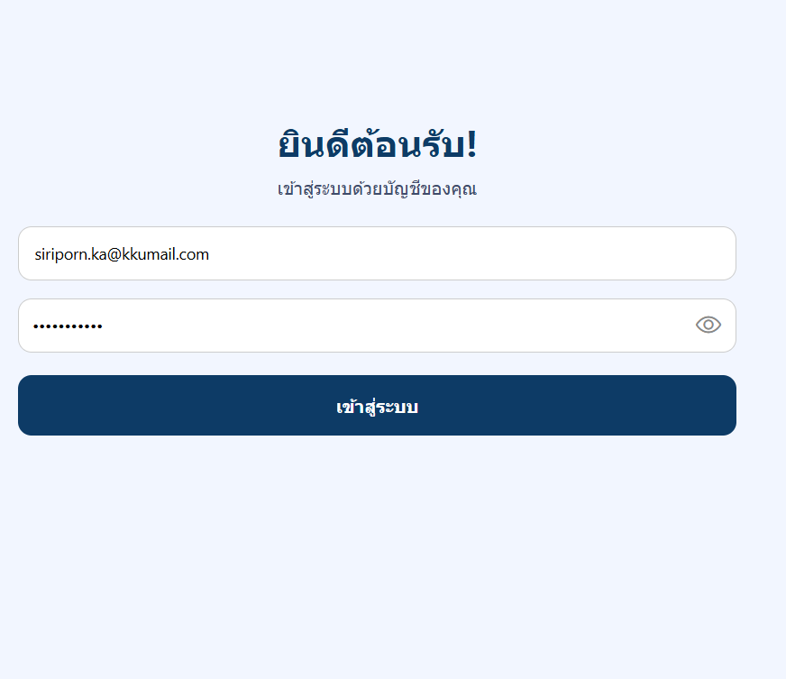

# Quiz-Hybrid-Mobile

**นางสาวศิริพร แก้วลินลา**  
**รหัสนักศึกษา:** 653450513-4

---
แอปพลิเคชันมือถือสำหรับนักศึกษา ใช้เพื่อดูสมาชิกชั้นปี โพสต์สถานะ แสดงความคิดเห็น และ Like/Unlike โพสต์  

พัฒนาโดยใช้ **React Native**, **Expo**, และ **React Navigation**

---

## 🔹 ฟีเจอร์หลัก

1. **ล็อกอินเข้าสู่ระบบ**


2. **ดูรายชื่อเพื่อนร่วมชั้นตามปีการศึกษา**
   

3. **โพสต์สถานะ**

4. **คอมเมนต์บนโพสต์**

5. **Like / Unlike โพสต์**

6. **รองรับการแสดงผลหลายขนาดหน้าจอ (responsive)**

---

## 🔹 โครงสร้างโปรเจกต์

Quiz-Hybrid-Mobile/
├─ src/
│  ├─ api/             # เรียกใช้งาน API
│  ├─ components/      # Card, ThemeToggle, UI Components
│  ├─ context/         # AuthContext, ThemeContext
│  ├─ screens/         # Login, Home, Classmates, PostDetail
│  └─ theme/           # Theme definitions
├─ App.tsx            
├─ package.json
└─ README.md


---

## 🔹 การติดตั้ง

1. **เข้าโฟลเดอร์โปรเจกต์**

```bash

ติดตั้ง dependencies

npm install 
npx expo install react-native-screens react-native-safe-area-context react-native-gesture-handler
npm install @react-navigation/native-stack --legacy-peer-deps
🔹 การรันแอป


npm start  


